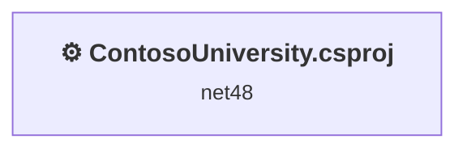
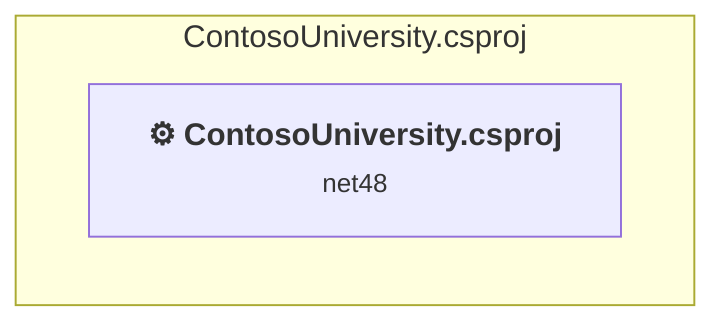

# Projects and dependencies analysis

This document provides a comprehensive overview of the projects and their dependencies in the context of upgrading to .NETCoreApp,Version=v10.0.

## Table of Contents

- [Executive Summary](#executive-Summary)
  - [Highlevel Metrics](#highlevel-metrics)
  - [Projects Compatibility](#projects-compatibility)
  - [Package Compatibility](#package-compatibility)
  - [API Compatibility](#api-compatibility)
- [Aggregate NuGet packages details](#aggregate-nuget-packages-details)
- [Top API Migration Challenges](#top-api-migration-challenges)
  - [Technologies and Features](#technologies-and-features)
  - [Most Frequent API Issues](#most-frequent-api-issues)
- [Projects Relationship Graph](#projects-relationship-graph)
- [Project Details](#project-details)

  - [ContosoUniversity.csproj](#contosouniversitycsproj)

## Executive Summary

### Highlevel Metrics

| Metric | Count | Status |
| :--- | :---: | :--- |
| Total Projects | 1 | All require upgrade |
| Total NuGet Packages | 45 | 26 need upgrade |
| Total Code Files | 56 |  |
| Total Code Files with Incidents | 15 |  |
| Total Lines of Code | 3392 |  |
| Total Number of Issues | 147 |  |
| Estimated LOC to modify | 92+ | at least 2.7% of codebase |

### Projects Compatibility

| Project | Target Framework | Difficulty | Package Issues | API Issues | Est. LOC Impact | Description |
| :--- | :---: | :---: | :---: | :---: | :---: | :--- |
| [ContosoUniversity.csproj](#contosouniversitycsproj) | net48 | 🔴 High | 40 | 92 | 92+ | Wap, Sdk Style = False |

### Package Compatibility

| Status | Count | Percentage |
| :--- | :---: | :---: |
| ✅ Compatible | 19 | 42.2% |
| ⚠️ Incompatible | 2 | 4.4% |
| 🔄 Upgrade Recommended | 24 | 53.3% |
| ***Total NuGet Packages*** | ***45*** | ***100%*** |

### API Compatibility

| Category | Count | Impact |
| :--- | :---: | :--- |
| 🔴 Binary Incompatible | 63 | High - Require code changes |
| 🟡 Source Incompatible | 29 | Medium - Needs re-compilation and potential conflicting API error fixing |
| 🔵 Behavioral change | 0 | Low - Behavioral changes that may require testing at runtime |
| ✅ Compatible | 1273 |  |
| ***Total APIs Analyzed*** | ***1365*** |  |

## Aggregate NuGet packages details

| Package | Current Version | Suggested Version | Projects | Description |
| :--- | :---: | :---: | :--- | :--- |
| Antlr | 3.4.1.9004 |  | [ContosoUniversity.csproj](#contosouniversitycsproj) | Needs to be replaced with Replace with new package Antlr4=4.6.6 |
| bootstrap | 5.3.3 |  | [ContosoUniversity.csproj](#contosouniversitycsproj) | ✅Compatible |
| jQuery | 3.7.1 |  | [ContosoUniversity.csproj](#contosouniversitycsproj) | ✅Compatible |
| jQuery.Validation | 1.21.0 |  | [ContosoUniversity.csproj](#contosouniversitycsproj) | ✅Compatible |
| Microsoft.AspNet.Mvc | 5.2.9 |  | [ContosoUniversity.csproj](#contosouniversitycsproj) | NuGet package functionality is included with framework reference |
| Microsoft.AspNet.Razor | 3.2.9 |  | [ContosoUniversity.csproj](#contosouniversitycsproj) | NuGet package functionality is included with framework reference |
| Microsoft.AspNet.Web.Optimization | 1.1.3 |  | [ContosoUniversity.csproj](#contosouniversitycsproj) | ⚠️NuGet package is incompatible |
| Microsoft.AspNet.WebPages | 3.2.9 |  | [ContosoUniversity.csproj](#contosouniversitycsproj) | NuGet package functionality is included with framework reference |
| Microsoft.Bcl.AsyncInterfaces | 1.1.1 | 10.0.5 | [ContosoUniversity.csproj](#contosouniversitycsproj) | NuGet package upgrade is recommended |
| Microsoft.Bcl.HashCode | 1.1.1 | 6.0.0 | [ContosoUniversity.csproj](#contosouniversitycsproj) | NuGet package upgrade is recommended |
| Microsoft.CodeDom.Providers.DotNetCompilerPlatform | 2.0.1 |  | [ContosoUniversity.csproj](#contosouniversitycsproj) | NuGet package functionality is included with framework reference |
| Microsoft.Data.SqlClient | 2.1.4 | 6.1.4 | [ContosoUniversity.csproj](#contosouniversitycsproj) | NuGet package contains security vulnerability |
| Microsoft.Data.SqlClient.SNI.runtime | 2.1.1 |  | [ContosoUniversity.csproj](#contosouniversitycsproj) | ✅Compatible |
| Microsoft.EntityFrameworkCore | 3.1.32 | 10.0.5 | [ContosoUniversity.csproj](#contosouniversitycsproj) | NuGet package upgrade is recommended |
| Microsoft.EntityFrameworkCore.Abstractions | 3.1.32 | 10.0.5 | [ContosoUniversity.csproj](#contosouniversitycsproj) | NuGet package upgrade is recommended |
| Microsoft.EntityFrameworkCore.Analyzers | 3.1.32 | 10.0.5 | [ContosoUniversity.csproj](#contosouniversitycsproj) | NuGet package upgrade is recommended |
| Microsoft.EntityFrameworkCore.Relational | 3.1.32 | 10.0.5 | [ContosoUniversity.csproj](#contosouniversitycsproj) | NuGet package upgrade is recommended |
| Microsoft.EntityFrameworkCore.SqlServer | 3.1.32 | 10.0.5 | [ContosoUniversity.csproj](#contosouniversitycsproj) | NuGet package upgrade is recommended |
| Microsoft.EntityFrameworkCore.Tools | 3.1.32 | 10.0.5 | [ContosoUniversity.csproj](#contosouniversitycsproj) | NuGet package upgrade is recommended |
| Microsoft.Extensions.Caching.Abstractions | 3.1.32 | 10.0.5 | [ContosoUniversity.csproj](#contosouniversitycsproj) | NuGet package upgrade is recommended |
| Microsoft.Extensions.Caching.Memory | 3.1.32 | 10.0.5 | [ContosoUniversity.csproj](#contosouniversitycsproj) | NuGet package upgrade is recommended |
| Microsoft.Extensions.Configuration | 3.1.32 | 10.0.5 | [ContosoUniversity.csproj](#contosouniversitycsproj) | NuGet package upgrade is recommended |
| Microsoft.Extensions.Configuration.Abstractions | 3.1.32 | 10.0.5 | [ContosoUniversity.csproj](#contosouniversitycsproj) | NuGet package upgrade is recommended |
| Microsoft.Extensions.Configuration.Binder | 3.1.32 | 10.0.5 | [ContosoUniversity.csproj](#contosouniversitycsproj) | NuGet package upgrade is recommended |
| Microsoft.Extensions.DependencyInjection | 3.1.32 | 10.0.5 | [ContosoUniversity.csproj](#contosouniversitycsproj) | NuGet package upgrade is recommended |
| Microsoft.Extensions.DependencyInjection.Abstractions | 3.1.32 | 10.0.5 | [ContosoUniversity.csproj](#contosouniversitycsproj) | NuGet package upgrade is recommended |
| Microsoft.Extensions.Logging | 3.1.32 | 10.0.5 | [ContosoUniversity.csproj](#contosouniversitycsproj) | NuGet package upgrade is recommended |
| Microsoft.Extensions.Logging.Abstractions | 3.1.32 | 10.0.5 | [ContosoUniversity.csproj](#contosouniversitycsproj) | NuGet package upgrade is recommended |
| Microsoft.Extensions.Options | 3.1.32 | 10.0.5 | [ContosoUniversity.csproj](#contosouniversitycsproj) | NuGet package upgrade is recommended |
| Microsoft.Extensions.Primitives | 3.1.32 | 10.0.5 | [ContosoUniversity.csproj](#contosouniversitycsproj) | NuGet package upgrade is recommended |
| Microsoft.Identity.Client | 4.21.1 |  | [ContosoUniversity.csproj](#contosouniversitycsproj) | ⚠️NuGet package is deprecated |
| Microsoft.jQuery.Unobtrusive.Validation | 4.0.0 |  | [ContosoUniversity.csproj](#contosouniversitycsproj) | ✅Compatible |
| Microsoft.Web.Infrastructure | 2.0.1 |  | [ContosoUniversity.csproj](#contosouniversitycsproj) | NuGet package functionality is included with framework reference |
| Modernizr | 2.6.2 |  | [ContosoUniversity.csproj](#contosouniversitycsproj) | ✅Compatible |
| NETStandard.Library | 2.0.3 |  | [ContosoUniversity.csproj](#contosouniversitycsproj) | NuGet package functionality is included with framework reference |
| Newtonsoft.Json | 13.0.3 | 13.0.4 | [ContosoUniversity.csproj](#contosouniversitycsproj) | NuGet package upgrade is recommended |
| System.Buffers | 4.5.1 |  | [ContosoUniversity.csproj](#contosouniversitycsproj) | NuGet package functionality is included with framework reference |
| System.Collections.Immutable | 1.7.1 | 10.0.5 | [ContosoUniversity.csproj](#contosouniversitycsproj) | NuGet package upgrade is recommended |
| System.ComponentModel.Annotations | 4.7.0 |  | [ContosoUniversity.csproj](#contosouniversitycsproj) | NuGet package functionality is included with framework reference |
| System.Diagnostics.DiagnosticSource | 4.7.1 | 10.0.5 | [ContosoUniversity.csproj](#contosouniversitycsproj) | NuGet package upgrade is recommended |
| System.Memory | 4.5.4 |  | [ContosoUniversity.csproj](#contosouniversitycsproj) | NuGet package functionality is included with framework reference |
| System.Numerics.Vectors | 4.5.0 |  | [ContosoUniversity.csproj](#contosouniversitycsproj) | NuGet package functionality is included with framework reference |
| System.Runtime.CompilerServices.Unsafe | 4.5.3 | 6.1.2 | [ContosoUniversity.csproj](#contosouniversitycsproj) | NuGet package upgrade is recommended |
| System.Threading.Tasks.Extensions | 4.5.4 |  | [ContosoUniversity.csproj](#contosouniversitycsproj) | NuGet package functionality is included with framework reference |
| WebGrease | 1.5.2 |  | [ContosoUniversity.csproj](#contosouniversitycsproj) | ✅Compatible |

## Top API Migration Challenges

### Technologies and Features

| Technology | Issues | Percentage | Migration Path |
| :--- | :---: | :---: | :--- |
| MSMQ & Message Queuing | 59 | 64.1% | Microsoft Message Queue (MSMQ) APIs for Windows-based message queuing that are not supported in .NET Core/.NET. MSMQ is a Windows-specific technology. Migrate to RabbitMQ, Azure Service Bus, or other modern message queues. |
| Legacy Configuration System | 16 | 17.4% | Legacy XML-based configuration system (app.config/web.config) that has been replaced by a more flexible configuration model in .NET Core. The old system was rigid and XML-based. Migrate to Microsoft.Extensions.Configuration with JSON/environment variables; use System.Configuration.ConfigurationManager NuGet package as interim bridge if needed. |
| ASP.NET Framework (System.Web) | 16 | 17.4% | Legacy ASP.NET Framework APIs for web applications (System.Web.*) that don't exist in ASP.NET Core due to architectural differences. ASP.NET Core represents a complete redesign of the web framework. Migrate to ASP.NET Core equivalents or consider System.Web.Adapters package for compatibility. |

### Most Frequent API Issues

| API | Count | Percentage | Category |
| :--- | :---: | :---: | :--- |
| T:System.Messaging.MessageQueue | 20 | 21.7% | Binary Incompatible |
| T:System.Messaging.MessageQueueAccessRights | 4 | 4.3% | Binary Incompatible |
| T:System.Configuration.ConfigurationManager | 4 | 4.3% | Source Incompatible |
| P:System.Web.HttpPostedFileBase.ContentLength | 4 | 4.3% | Source Incompatible |
| T:System.Messaging.MessageQueueErrorCode | 3 | 3.3% | Binary Incompatible |
| T:System.Messaging.MessagePriority | 3 | 3.3% | Binary Incompatible |
| T:System.Messaging.Message | 2 | 2.2% | Binary Incompatible |
| T:System.Messaging.XmlMessageFormatter | 2 | 2.2% | Binary Incompatible |
| M:System.Messaging.XmlMessageFormatter.#ctor(System.Type[]) | 2 | 2.2% | Binary Incompatible |
| T:System.Messaging.IMessageFormatter | 2 | 2.2% | Binary Incompatible |
| P:System.Messaging.MessageQueue.Formatter | 2 | 2.2% | Binary Incompatible |
| M:System.Messaging.MessageQueue.#ctor(System.String) | 2 | 2.2% | Binary Incompatible |
| F:System.Messaging.MessageQueueAccessRights.FullControl | 2 | 2.2% | Binary Incompatible |
| M:System.Messaging.MessageQueue.SetPermissions(System.String,System.Messaging.MessageQueueAccessRights) | 2 | 2.2% | Binary Incompatible |
| M:System.Messaging.MessageQueue.Create(System.String) | 2 | 2.2% | Binary Incompatible |
| M:System.Messaging.MessageQueue.Exists(System.String) | 2 | 2.2% | Binary Incompatible |
| P:System.Configuration.ConfigurationManager.AppSettings | 2 | 2.2% | Source Incompatible |
| T:System.Configuration.ConnectionStringSettingsCollection | 2 | 2.2% | Source Incompatible |
| P:System.Configuration.ConfigurationManager.ConnectionStrings | 2 | 2.2% | Source Incompatible |
| T:System.Configuration.ConnectionStringSettings | 2 | 2.2% | Source Incompatible |
| P:System.Configuration.ConnectionStringSettingsCollection.Item(System.String) | 2 | 2.2% | Source Incompatible |
| P:System.Configuration.ConnectionStringSettings.ConnectionString | 2 | 2.2% | Source Incompatible |
| T:System.Web.HttpPostedFileBase | 2 | 2.2% | Source Incompatible |
| M:System.Web.HttpPostedFileBase.SaveAs(System.String) | 2 | 2.2% | Source Incompatible |
| P:System.Web.HttpPostedFileBase.FileName | 2 | 2.2% | Source Incompatible |
| T:System.Web.Routing.RouteCollection | 2 | 2.2% | Binary Incompatible |
| F:System.Messaging.MessageQueueErrorCode.IOTimeout | 1 | 1.1% | Binary Incompatible |
| P:System.Messaging.MessageQueueException.MessageQueueErrorCode | 1 | 1.1% | Binary Incompatible |
| P:System.Messaging.Message.Body | 1 | 1.1% | Binary Incompatible |
| M:System.TimeSpan.FromSeconds(System.Double) | 1 | 1.1% | Source Incompatible |
| M:System.Messaging.MessageQueue.Receive(System.TimeSpan) | 1 | 1.1% | Binary Incompatible |
| M:System.Messaging.MessageQueue.Send(System.Object) | 1 | 1.1% | Binary Incompatible |
| F:System.Messaging.MessagePriority.Normal | 1 | 1.1% | Binary Incompatible |
| P:System.Messaging.Message.Priority | 1 | 1.1% | Binary Incompatible |
| P:System.Messaging.Message.Label | 1 | 1.1% | Binary Incompatible |
| M:System.Messaging.Message.#ctor(System.Object) | 1 | 1.1% | Binary Incompatible |
| T:System.Web.Routing.RouteTable | 1 | 1.1% | Binary Incompatible |
| P:System.Web.Routing.RouteTable.Routes | 1 | 1.1% | Binary Incompatible |
| M:System.Web.HttpApplication.#ctor | 1 | 1.1% | Source Incompatible |
| T:System.Web.HttpApplication | 1 | 1.1% | Source Incompatible |

## Projects Relationship Graph

Legend:
📦 SDK-style project
⚙️ Classic project

## Project Details

### ContosoUniversity.csproj

#### Project Info

- **Current Target Framework:** net48
- **Proposed Target Framework:** net10.0
- **SDK-style**: False
- **Project Kind:** Wap
- **Dependencies**: 0
- **Dependants**: 0
- **Number of Files**: 83
- **Number of Files with Incidents**: 15
- **Lines of Code**: 3392
- **Estimated LOC to modify**: 92+ (at least 2.7% of the project)

#### Dependency Graph

Legend:
📦 SDK-style project
⚙️ Classic project

### API Compatibility

| Category | Count | Impact |
| :--- | :---: | :--- |
| 🔴 Binary Incompatible | 63 | High - Require code changes |
| 🟡 Source Incompatible | 29 | Medium - Needs re-compilation and potential conflicting API error fixing |
| 🔵 Behavioral change | 0 | Low - Behavioral changes that may require testing at runtime |
| ✅ Compatible | 1273 |  |
| ***Total APIs Analyzed*** | ***1365*** |  |

#### Project Technologies and Features

| Technology | Issues | Percentage | Migration Path |
| :--- | :---: | :---: | :--- |
| MSMQ & Message Queuing | 59 | 64.1% | Microsoft Message Queue (MSMQ) APIs for Windows-based message queuing that are not supported in .NET Core/.NET. MSMQ is a Windows-specific technology. Migrate to RabbitMQ, Azure Service Bus, or other modern message queues. |
| Legacy Configuration System | 16 | 17.4% | Legacy XML-based configuration system (app.config/web.config) that has been replaced by a more flexible configuration model in .NET Core. The old system was rigid and XML-based. Migrate to Microsoft.Extensions.Configuration with JSON/environment variables; use System.Configuration.ConfigurationManager NuGet package as interim bridge if needed. |
| ASP.NET Framework (System.Web) | 16 | 17.4% | Legacy ASP.NET Framework APIs for web applications (System.Web.*) that don't exist in ASP.NET Core due to architectural differences. ASP.NET Core represents a complete redesign of the web framework. Migrate to ASP.NET Core equivalents or consider System.Web.Adapters package for compatibility. |

