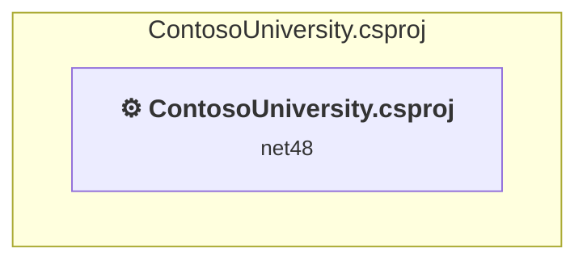

# ContosoUniversity.csproj

[← Back to the assessment index](../../assessment.md)

## Project Info

- **Current Target Framework:** net48
- **Proposed Target Framework:** net10.0
- **SDK-style**: False
- **Project Kind:** Wap
- **Dependencies**: 0
- **Dependants**: 0
- **Number of Files**: 83
- **Number of Files with Incidents**: 24
- **Lines of Code**: 3392
- **Estimated LOC to modify**: 569+ (at least 16.8% of the project)

## Dependency Graph

Legend:
📦 SDK-style project
⚙️ Classic project

## API Compatibility

| Category | Count | Impact |
| :--- | :---: | :--- |
| 🔴 Binary Incompatible | 532 | High - Require code changes |
| 🟡 Source Incompatible | 37 | Medium - Needs re-compilation and potential conflicting API error fixing |
| 🔵 Behavioral change | 0 | Low - Behavioral changes that may require testing at runtime |
| ✅ Compatible | 1902 |  |
| ***Total APIs Analyzed*** | ***2471*** |  |

## NuGet Package Issues

| Package | Current Version | Suggested Version | Severity | Issue |
| :--- | :---: | :---: | :---: | :--- |
| Antlr | 3.4.1.9004 | Replace with new package Antlr4=4.6.6 | 🟡 Potential | NuGet package upgrade is recommended |
| Microsoft.AspNet.Mvc | 5.2.9 | — | 🔴 Mandatory | NuGet package functionality is included with framework reference |
| Microsoft.AspNet.Razor | 3.2.9 | — | 🔴 Mandatory | NuGet package functionality is included with framework reference |
| Microsoft.AspNet.Web.Optimization | 1.1.3 | — | 🔴 Mandatory | NuGet package is incompatible |
| Microsoft.AspNet.WebPages | 3.2.9 | — | 🔴 Mandatory | NuGet package functionality is included with framework reference |
| Microsoft.Bcl.AsyncInterfaces | 1.1.1 | 10.0.12 | 🟡 Potential | NuGet package upgrade is recommended |
| Microsoft.Bcl.HashCode | 1.1.1 | 6.0.0 | 🟡 Potential | NuGet package upgrade is recommended |
| Microsoft.CodeDom.Providers.DotNetCompilerPlatform | 2.0.1 | — | 🔴 Mandatory | NuGet package functionality is included with framework reference |
| Microsoft.Data.SqlClient | 2.1.4 | 7.1.0 | 🔵 Optional | NuGet package contains security vulnerability |
| Microsoft.EntityFrameworkCore | 3.1.32 | 10.0.12 | 🟡 Potential | NuGet package upgrade is recommended |
| Microsoft.EntityFrameworkCore.Abstractions | 3.1.32 | 10.0.12 | 🟡 Potential | NuGet package upgrade is recommended |
| Microsoft.EntityFrameworkCore.Analyzers | 3.1.32 | 10.0.12 | 🟡 Potential | NuGet package upgrade is recommended |
| Microsoft.EntityFrameworkCore.Relational | 3.1.32 | 10.0.12 | 🟡 Potential | NuGet package upgrade is recommended |
| Microsoft.EntityFrameworkCore.SqlServer | 3.1.32 | 10.0.12 | 🟡 Potential | NuGet package upgrade is recommended |
| Microsoft.EntityFrameworkCore.Tools | 3.1.32 | 10.0.12 | 🟡 Potential | NuGet package upgrade is recommended |
| Microsoft.Extensions.Caching.Abstractions | 3.1.32 | 10.0.12 | 🟡 Potential | NuGet package upgrade is recommended |
| Microsoft.Extensions.Caching.Memory | 3.1.32 | 10.0.12 | 🟡 Potential | NuGet package upgrade is recommended |
| Microsoft.Extensions.Configuration | 3.1.32 | 10.0.12 | 🟡 Potential | NuGet package upgrade is recommended |
| Microsoft.Extensions.Configuration.Abstractions | 3.1.32 | 10.0.12 | 🟡 Potential | NuGet package upgrade is recommended |
| Microsoft.Extensions.Configuration.Binder | 3.1.32 | 10.0.12 | 🟡 Potential | NuGet package upgrade is recommended |
| Microsoft.Extensions.DependencyInjection | 3.1.32 | 10.0.12 | 🟡 Potential | NuGet package upgrade is recommended |
| Microsoft.Extensions.DependencyInjection.Abstractions | 3.1.32 | 10.0.12 | 🟡 Potential | NuGet package upgrade is recommended |
| Microsoft.Extensions.Logging | 3.1.32 | 10.0.12 | 🟡 Potential | NuGet package upgrade is recommended |
| Microsoft.Extensions.Logging.Abstractions | 3.1.32 | 10.0.12 | 🟡 Potential | NuGet package upgrade is recommended |
| Microsoft.Extensions.Options | 3.1.32 | 10.0.12 | 🟡 Potential | NuGet package upgrade is recommended |
| Microsoft.Extensions.Primitives | 3.1.32 | 10.0.12 | 🟡 Potential | NuGet package upgrade is recommended |
| Microsoft.Web.Infrastructure | 2.0.1 | — | 🔴 Mandatory | NuGet package functionality is included with framework reference |
| NETStandard.Library | 2.0.3 | — | 🔴 Mandatory | NuGet package functionality is included with framework reference |
| Newtonsoft.Json | 13.0.3 | 13.0.4 | 🟡 Potential | NuGet package upgrade is recommended |
| System.Buffers | 4.5.1 | — | 🔴 Mandatory | NuGet package functionality is included with framework reference |
| System.Collections.Immutable | 1.7.1 | 10.0.12 | 🟡 Potential | NuGet package upgrade is recommended |
| System.ComponentModel.Annotations | 4.7.0 | — | 🔴 Mandatory | NuGet package functionality is included with framework reference |
| System.Diagnostics.DiagnosticSource | 4.7.1 | 10.0.12 | 🟡 Potential | NuGet package upgrade is recommended |
| System.Memory | 4.5.4 | — | 🔴 Mandatory | NuGet package functionality is included with framework reference |
| System.Numerics.Vectors | 4.5.0 | — | 🔴 Mandatory | NuGet package functionality is included with framework reference |
| System.Runtime.CompilerServices.Unsafe | 4.5.3 | 6.1.2 | 🟡 Potential | NuGet package upgrade is recommended |
| System.Threading.Tasks.Extensions | 4.5.4 | — | 🔴 Mandatory | NuGet package functionality is included with framework reference |

Every project affected by these packages, and the versions the repository settles on: [aggregate NuGet packages](../nuget/aggregate-packages.md).

## Binding Redirect Configuration

| Rule | Severity | Details | Recommendation |
| :--- | :---: | :--- | :--- |
| Manual redirect conflicts with auto-generated version | 🔴 Mandatory | Manual redirect for Newtonsoft.Json targets 13.0.0.0 but auto-generation would target 13.0.3 (MSB3836 conflict) | Remove the conflicting manual binding redirect or disable auto-generation. |
| Manual redirect conflicts with auto-generated version | 🔴 Mandatory | Manual redirect for System.Threading.Tasks.Extensions targets 4.2.0.1 but auto-generation would target 4.5.4 (MSB3836 conflict) | Remove the conflicting manual binding redirect or disable auto-generation. |
| Manual redirect conflicts with auto-generated version | 🔴 Mandatory | Manual redirect for System.ComponentModel.Annotations targets 4.2.1.0 but auto-generation would target 4.7.0 (MSB3836 conflict) | Remove the conflicting manual binding redirect or disable auto-generation. |
| Manual redirect conflicts with auto-generated version | 🔴 Mandatory | Manual redirect for System.Runtime.CompilerServices.Unsafe targets 4.0.6.0 but auto-generation would target 4.5.3 (MSB3836 conflict) | Remove the conflicting manual binding redirect or disable auto-generation. |
| Manual redirect conflicts with auto-generated version | 🔴 Mandatory | Manual redirect for System.Memory targets 4.0.1.1 but auto-generation would target 4.5.4 (MSB3836 conflict) | Remove the conflicting manual binding redirect or disable auto-generation. |
| Manual redirect conflicts with auto-generated version | 🔴 Mandatory | Manual redirect for Microsoft.Data.SqlClient targets 2.0.20168.4 but auto-generation would target 2.1.4 (MSB3836 conflict) | Remove the conflicting manual binding redirect or disable auto-generation. |
| Binding redirect forces version downgrade | 🟡 Potential | Binding redirect for Microsoft.Data.SqlClient targets 2.0.20168.4 but package provides 2.1.4 | Update the binding redirect newVersion to match the version provided by the NuGet package. |
| Binding redirect forces version downgrade | 🟡 Potential | Binding redirect for Newtonsoft.Json targets 13.0.0.0 but package provides 13.0.3 | Update the binding redirect newVersion to match the version provided by the NuGet package. |
| Binding redirect forces version downgrade | 🟡 Potential | Binding redirect for System.ComponentModel.Annotations targets 4.2.1.0 but package provides 4.7.0 | Update the binding redirect newVersion to match the version provided by the NuGet package. |
| Binding redirect forces version downgrade | 🟡 Potential | Binding redirect for System.Memory targets 4.0.1.1 but package provides 4.5.4 | Update the binding redirect newVersion to match the version provided by the NuGet package. |
| Binding redirect forces version downgrade | 🟡 Potential | Binding redirect for System.Runtime.CompilerServices.Unsafe targets 4.0.6.0 but package provides 4.5.3 | Update the binding redirect newVersion to match the version provided by the NuGet package. |
| Binding redirect forces version downgrade | 🟡 Potential | Binding redirect for System.Threading.Tasks.Extensions targets 4.2.0.1 but package provides 4.5.4 | Update the binding redirect newVersion to match the version provided by the NuGet package. |

## Project Technologies and Features

| Technology | Issues | Percentage | Migration Path |
| :--- | :---: | :---: | :--- |
| MSMQ & Message Queuing | 57 | 10.0% | Microsoft Message Queue (MSMQ) APIs for Windows-based message queuing that are not supported in .NET Core/.NET. MSMQ is a Windows-specific technology. Migrate to RabbitMQ, Azure Service Bus, or other modern message queues. |
| Legacy Configuration System | 16 | 2.8% | Legacy XML-based configuration system (app.config/web.config) that has been replaced by a more flexible configuration model in .NET Core. The old system was rigid and XML-based. Migrate to Microsoft.Extensions.Configuration with JSON/environment variables; use System.Configuration.ConfigurationManager NuGet package as interim bridge if needed. |
| ASP.NET Framework (System.Web) | 495 | 87.0% | Legacy ASP.NET Framework APIs for web applications (System.Web.*) that don't exist in ASP.NET Core due to architectural differences. ASP.NET Core represents a complete redesign of the web framework. Migrate to ASP.NET Core equivalents or consider System.Web.Adapters package for compatibility. |

